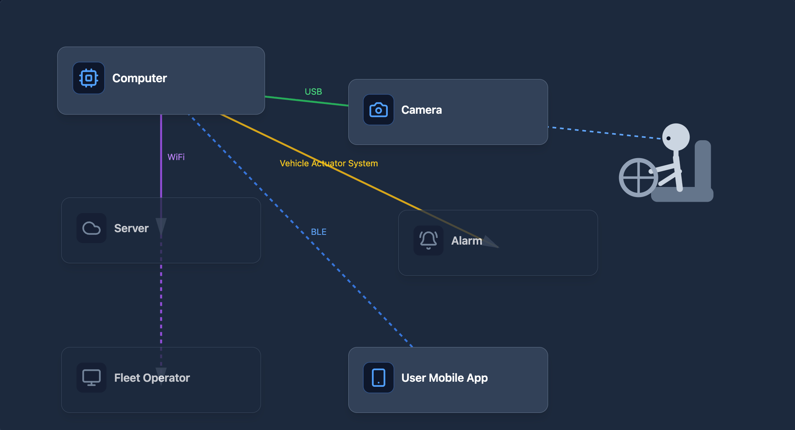
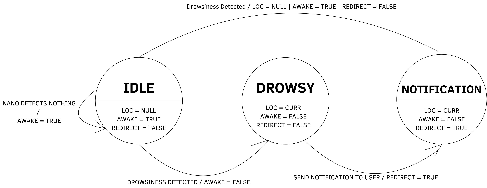

# Design

## Design Features
### Driver Monitoring Features
* **Real-time driver face detection:** The system continuously detects and tracks the driver’s face using a camera mounted on the windshield.
* **Eye closure detection:** The AI model monitors eye closure duration to identify signs of fatigue or microsleep.
* **Blink rate analysis:** Abnormally slow or irregular blinking patterns are used as indicators of drowsiness.
* **Head position monitoring:** The system detects head drooping or nodding, which commonly occurs when a driver begins falling asleep.
* **Driver attention tracking:** The model determines whether the driver is looking forward at the road or looking away for extended periods of time.

### Alert and Safety Features
* **Real-time driver alert:** Audible alarms or phone notifications are triggered when unsafe behavior is detected. 
* **Tiered alert system:** The system provides multiple alert levels, starting with early warnings and escalating to stronger alerts if fatigue worsens.
* **Driver break recommendations:** When fatigue indicators persist, the system suggests that the driver pull over and take a rest break.
* **Driver not visible detection:** If the driver leaves the camera’s field of view, the system alerts the user that monitoring cannot continue.
* **Camera misalignment detection:** The system detects if the camera has moved or is no longer pointed correctly and requests recalibration.

### Mobile App Features
* **Cross-platform mobile application:** A Flutter-based mobile app allows the system to run on Android, iOS, and web platforms.
* **Real-time push notifications:** Alerts are sent directly to the driver’s phone when unsafe behavior is detected.
* **Driver status display:** The mobile app shows the current monitoring state, such as alert, warning, or normal.
* **Driver Connectivity Monitoring:** The app warns users when the mobile device loses connection with the monitoring hardware.
* **GPS Routing System:** The app allows the user to find nearby rest stops, gas stations, cafes, etc., with direct links to Google Maps or Apple Maps. Additionally, it previews the route for the driver to see which is the best one to take.

### Fleet Management Features
* **Fleet Operator Dashboard:** Fleet managers can monitor safety alerts and driver behavior across multiple vehicles.
* **Driver risk event reporting:** The system logs events such as drowsiness alerts, distractions, and monitoring failures.
* **Driver safety trend analysis:** Historical data can be analyzed to identify drivers who frequently experience fatigue.
* **Remote safety notifications:** Fleet operators receive alerts when high-risk behavior is detected.

### System Architecture
* **On-device AI processing:** The driver monitoring model runs locally on the device, reducing latency and cloud dependency.
* **Offline operation capability:** The system continues monitoring and generating alerts even when internet connectivity is unavailable.
* **Custom PCB integration:** A custom printed circuit board hosts the system components and manages communication between hardware modules.

## Diagrams

## Technology
The brains of the device is the custom PCB (a.k.a the computer) that hosts the AI model we run. The PCB needs a powerful GPU capable of running an AI model. The model itself is programmed in the Python programming language and uses Mediapipe. The notifications are pushed to a Frontend app that works on Android, iOS, and Web. The app itself was made using Flutter which uses Dart to program the app. The dependencies needed for programming on Android and iOS are the Android SDK and XCode respectively.
